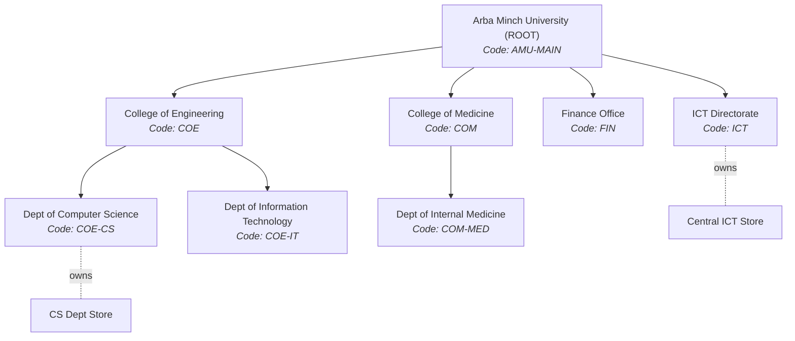
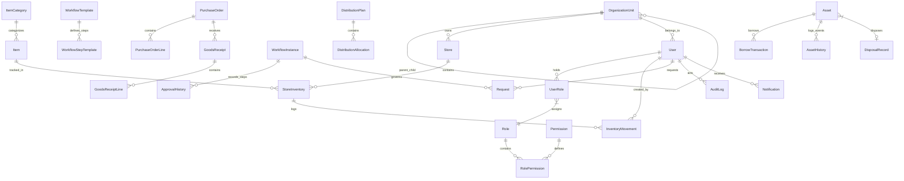
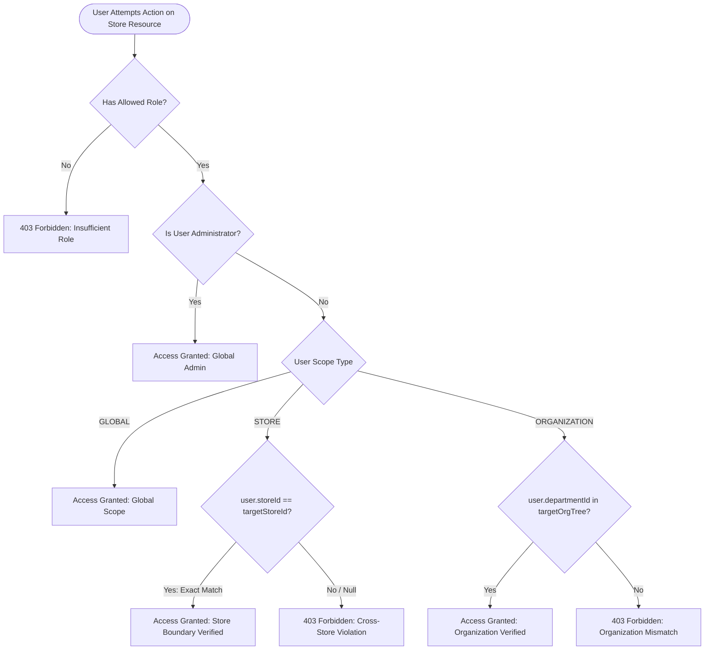
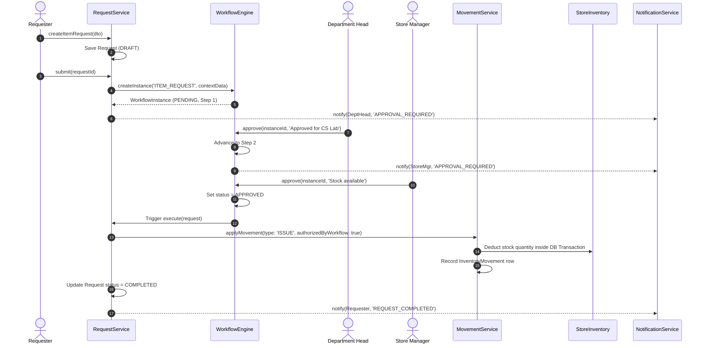
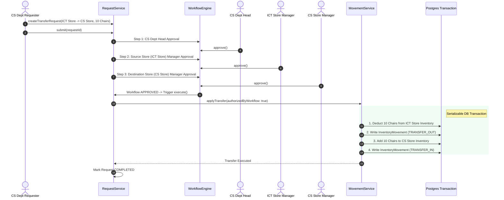
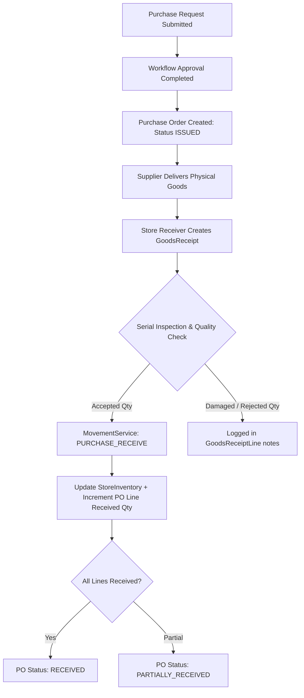
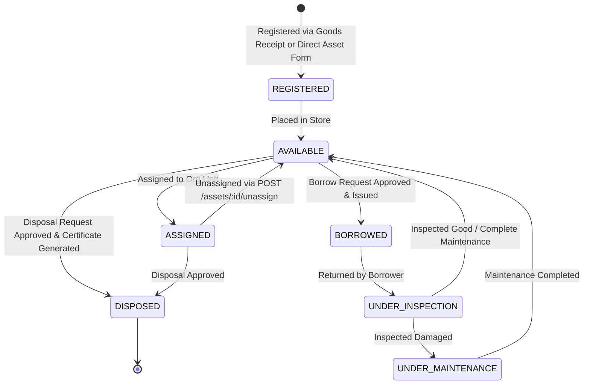

# Arba Minch University (AMU) Resource Management System
## Master Architecture, Design Specifications & Comprehensive Operation Manual

---

## 1. System Overview & Core Purpose

### 1.1 Institutional Context & Problem Statement
Arba Minch University (AMU) is one of Ethiopia's premier higher education institutions, comprising multiple campuses, colleges, faculties, research institutes, central directorates, and administrative units. In such an expansive academic ecosystem, managing equipment, consumable supplies, and high-value fixed assets presents significant operational challenges:

- **Decentralized Operations vs. Central Accountability**: Departments require operational speed to acquire and transfer resources, while university leadership requires absolute auditability and strict fiscal governance.
- **Paper-Based & Fragile Audits**: Legacy physical requisition forms lead to untrackable stock movements, loss of asset custody, phantom inventories, and inability to trace serial numbers.
- **Scope Ambiguity**: Store managers often lack clear boundary controls over which items they can issue, or get deadlocked when attempting inter-departmental transfers.

### 1.2 The AMU Solution
The **AMU Resource Management System** is a unified, web-based Enterprise Resource Planning (ERP) platform designed to manage the entire resource lifecycle:

$$\text{Item Cataloging} \longrightarrow \text{Store Provisioning} \longrightarrow \text{Request Filing} \longrightarrow \text{Multi-Step Approval} \longrightarrow \text{Atomic Execution} \longrightarrow \text{Custody/Asset Tracking} \longrightarrow \text{Disposal/Audit}$$

---

## 2. Inviolable Architectural Principles

The system's integrity relies on **Four Architectural Invariants**:

```
+-----------------------------------------------------------------------------------+
|                            INVIOLABLE PRINCIPLE 1                                 |
|                       Strict Request-Driven Execution                             |
|  No database entity (Stock, Asset, Purchase, Allocation) can be modified directly.|
|  Every physical change MUST originate from a Request governed by a Workflow.       |
+-----------------------------------------------------------------------------------+
                                         │
                                         ▼
+-----------------------------------------------------------------------------------+
|                            INVIOLABLE PRINCIPLE 2                                 |
|                 MovementService Quantity Sequestration                            |
|  StoreInventory.quantity is isolated to MovementService inside DB transactions.   |
|  Direct UPDATE statements outside MovementService are prohibited by policy.       |
+-----------------------------------------------------------------------------------+
                                         │
                                         ▼
+-----------------------------------------------------------------------------------+
|                            INVIOLABLE PRINCIPLE 3                                 |
|                 Two-Part Authorization (Permission + Scope)                       |
|  Holding a Permission (e.g. inventory.issue) is invalid without matching Scope   |
|  (GLOBAL, ORGANIZATION, or STORE) over the target entity.                         |
+-----------------------------------------------------------------------------------+
                                         │
                                         ▼
+-----------------------------------------------------------------------------------+
|                            INVIOLABLE PRINCIPLE 4                                 |
|            Workflow Approval as Higher-Level Authorization                        |
|  Final workflow approval grants system execution authority (authorizedByWorkflow).|
|  Execution is authorized by the completed chain, bypassing actor scope limits.    |
+-----------------------------------------------------------------------------------+
```

---

## 3. Technology Stack & Architectural Rationale

### 3.1 Tech Stack Matrix

```
┌──────────────────────────────────────────────────────────────────────────────────┐
│                                 FRONTEND TIER                                    │
│   React 18  │  Vite  │  TypeScript  │  Tailwind CSS  │  TanStack Query  │ Zustand│
└────────────────────────────────────────┬─────────────────────────────────────────┘
                                         │ RESTful APIs / Bearer JWT
┌────────────────────────────────────────▼─────────────────────────────────────────┐
│                                 BACKEND TIER                                     │
│   NestJS Framework │ TypeScript │ Prisma ORM │ Argon2 │ Nodemailer │ Swagger OpenAPI │
└────────────────────────────────────────┬─────────────────────────────────────────┘
                                         │ PostgreSQL Protocol
┌────────────────────────────────────────▼─────────────────────────────────────────┐
│                                DATABASE & INFRA                                  │
│   PostgreSQL 16 │ Redis │ Multi-Stage Docker │ Nginx Security Proxy │ E2E Supertest│
└──────────────────────────────────────────────────────────────────────────────────┘
```

#### Detailed Justification Table:

| Layer | Component | Selection Rationale & Implementation Details |
|---|---|---|
| **Backend** | **NestJS** | Provides enterprise-grade dependency injection, decoratored route controllers, module boundary isolation, and structured middleware/guard pipelines. |
| **Backend** | **Prisma ORM** | Guarantees compile-time database type safety, serializable transaction isolation, self-referential tree traversal, and clean migration workflows. |
| **Backend** | **PostgreSQL** | Relational ACID engine supporting raw SQL analytics queries, JSONB columns for flexible request details, and serializable transactions. |
| **Backend** | **Argon2id** | State-of-the-art memory-hard password hashing algorithm replacing older bcrypt variants. |
| **Backend** | **Dual JWT Auth** | Emits short-lived access tokens (15m) and long-lived refresh tokens (7d) stored in the database with rotation upon refresh. |
| **Frontend** | **React 18 + Vite** | Provides instantaneous HMR, optimized production bundler, functional components with hooks, and responsive rendering. |
| **Frontend** | **Tailwind CSS** | Utility-first styling framework enabling custom design tokens (primary slate `#0f172a`, accent emerald `#059669`, custom dark surfaces). |
| **Frontend** | **TanStack Query** | Manages asynchronous server state caching, automatic background refetching, mutation side-effects, and unread notification badge polling. |
| **Frontend** | **Zustand** | Lightweight, boilerplate-free state manager for persistent user session tokens (`auth.store.ts`). |
| **Infra** | **Docker Compose** | Standardizes multi-container deployment across backend, frontend, PostgreSQL, Redis, and Nginx. |

---

## 4. System Hierarchy & Data Model Architecture

### 4.1 Organizational Hierarchy Tree
The university structure is represented as a self-referential graph (`OrganizationUnit` with `parentId`).



### 4.2 Database Schema Entity-Relationship Diagram (ERD)



---

## 5. Security & Access Control Mechanics

### 5.1 Authoritative 5-Role Permission Matrix

The AMU Resource Management System implements a strict, enterprise-grade Role-Based Access Control (RBAC) architecture enforced at both the HTTP Controller layer (via `@Roles(...)` metadata and NestJS `RolesGuard`) and the Business Application layer (via `AccessControlService`).

The 5 system roles are:
1. **`ADMINISTRATOR`**: System IT & administration, user provisioning, department lifecycle, and audit oversight.
2. **`STORE_MANAGER`**: Operational item catalog master owner, category administrator, employee registrar, supplier collaborator, and store-scoped material request approver.
3. **`STOREKEEPER`**: Warehouse custody operator, physical stock receiver (Stock In), stock issuer (Stock Out / Request Fulfillment), return handler, and stock adjustment auditor.
4. **`AUDITOR`**: Compliance officer with read-only inspection access across system-wide audit logs, stock summaries, transaction ledgers, and analytical reports.
5. **`REQUESTER`**: University academic/administrative staff member who files material requests and tracks request status.

| Module & Endpoint | Method | Path | `ADMINISTRATOR` | `STORE_MANAGER` | `STOREKEEPER` | `AUDITOR` | `REQUESTER` | Enforcement Mechanism |
|---|---|---|:---:|:---:|:---:|:---:|:---:|---|
| **Material Catalog (Write)** | `POST`, `PATCH`, `DELETE` | `/materials/*` | ❌ (403) | ✅ (200/201) | ❌ (403) | ❌ (403) | ❌ (403) | Role Guard (`STORE_MANAGER` only) |
| **Material Categories (Write)**| `POST` | `/materials/categories` | ❌ (403) | ✅ (201) | ❌ (403) | ❌ (403) | ❌ (403) | Role Guard (`STORE_MANAGER` only) |
| **Material Catalog (Read)** | `GET` | `/materials`, `/materials/:id`, `/materials/categories` | ✅ (200) | ✅ (200) | ✅ (200) | ✅ (200) | ✅ (200) | Authenticated (All Roles) |
| **Employee Registry (Write)** | `POST` | `/employees` | ✅ (201) | ✅ (201) | ❌ (403) | ❌ (403) | ❌ (403) | Role Guard (`ADMIN`, `STORE_MANAGER`) |
| **Department Management** | `POST` | `/employees/departments` | ✅ (201) | ❌ (403) | ❌ (403) | ❌ (403) | ❌ (403) | Role Guard (`ADMINISTRATOR` only) |
| **Employee Registry (Read)** | `GET` | `/employees`, `/employees/:id`, `/employees/departments/*` | ✅ (200) | ✅ (200) | ✅ (200) | ✅ (200) | ✅ (200) | Authenticated (All Roles) |
| **Audit Logs Inspection** | `GET` | `/audit` | ✅ (200) | ❌ (403) | ❌ (403) | ✅ (200) | ❌ (403) | Role Guard (`ADMIN`, `AUDITOR`) |
| **Supplier Directory (Write)**| `POST`, `PATCH` | `/suppliers`, `/suppliers/:id` | ✅ (200/201) | ✅ (200/201) | ❌ (403) | ❌ (403) | ❌ (403) | Role Guard (`ADMIN`, `STORE_MANAGER`) |
| **Supplier Directory (Read)** | `GET` | `/suppliers`, `/suppliers/:id` | ✅ (200) | ✅ (200) | ✅ (200) | ✅ (200) | ✅ (200) | Authenticated (All Roles) |
| **User Administration** | `GET`, `POST`, `PATCH`, `DELETE` | `/users`, `/users/:id`, `/users/:id/*` | ✅ (200/201) | ❌ (403) | ❌ (403) | ❌ (403) | ❌ (403) | Role Guard (`ADMINISTRATOR` only) |
| **Inventory Operations (Stock In/Out)** | `POST` | `/inventory/stock-in`, `/inventory/stock-out`, `/inventory/return`, `/inventory/adjustment`, `/inventory/transfer` | ❌ (403) | ❌ (403) | ✅ (201) | ❌ (403) | ❌ (403) | Role Guard (`STOREKEEPER` only) |
| **Inventory Transactions (Read)** | `GET` | `/inventory/transactions`, `/inventory/alerts/low-stock` | ✅ (200) | ✅ (200) | ✅ (200) | ✅ (200) | ✅ (200) | Authenticated (All Roles) |
| **Material Request Filing** | `POST` | `/requests` | ✅ (201) | ✅ (201) | ✅ (201) | ✅ (201) | ✅ (201) | Authenticated (Requester Identity Scoped) |
| **Material Request List & Detail** | `GET` | `/requests`, `/requests/:id` | ✅ (200) | ✅ (200) | ✅ (200) | ✅ (200) | ✅ (200) | Authenticated (All Roles) |
| **Material Request Approval** | `POST` | `/requests/:id/approve-reject` | ✅ (200)* | ✅ (200) | ❌ (403) | ❌ (403) | ❌ (403) | **Role Guard + Store Scope Enforced** |
| **Material Request Issuance** | `POST` | `/requests/:id/issue` | ❌ (403) | ❌ (403) | ✅ (200) | ❌ (403) | ❌ (403) | Role Guard (`STOREKEEPER` only) |
| **Analytical Reports** | `GET` | `/reports/*` (current-stock, stock-in, stock-out, material-balance, low-stock, employee-issue, supplier, transaction-history) | ✅ (200) | ✅ (200) | ✅ (200) | ✅ (200) | ❌ (403) | Role Guard (`ADMIN`, `STORE_MANAGER`, `STOREKEEPER`, `AUDITOR`) |
| **Notifications Inbox** | `GET`, `PATCH`, `POST` | `/notifications`, `/notifications/:id/read`, `/notifications/read-all` | ✅ (200) | ✅ (200) | ✅ (200) | ✅ (200) | ✅ (200) | Authenticated (User Identity Scoped) |
| **Dashboard Metrics** | `GET` | `/dashboard/metrics`, `/dashboard/recent-activity` | ✅ (200) | ✅ (200) | ✅ (200) | ✅ (200) | ✅ (200) | Authenticated (All Roles) |
| **Authentication & Profile** | `POST`, `GET` | `/auth/login`, `/auth/register`, `/auth/refresh`, `/auth/me` | ✅ (200/201) | ✅ (200/201) | ✅ (200/201) | ✅ (200/201) | ✅ (200/201) | Public / JWT Authenticated |

*\*Note: Administrator retains system-level global emergency override authority.*

---

### 5.2 Three-Tier Scope Architecture (`GLOBAL`, `STORE`, `ORGANIZATION`)

In addition to role-based access, the system enforces multi-tenant and multi-store isolation through the `ScopeType` engine:



1. **`GLOBAL` Scope (`ScopeType.GLOBAL`)**:
   - The user possesses unrestricted operational authority across all physical stores and faculties across the university.
   - Used for System Administrators, the Global Store Manager, and Central Internal Auditors.
   - Example: A Store Manager with `GLOBAL` scope (`globalmanager@store.com`) can approve material requests targeting Store A (`STORE-MAIN`), Store B (`STORE-ENG`), or any future store.

2. **`STORE` Scope (`ScopeType.STORE`)**:
   - The user's authority is strictly bounded to a single physical store identified by `user.storeId`.
   - Used for Store Managers and Storekeepers assigned to specific faculties or central warehouses.
   - Example: Store Manager A (`manager@store.com`, assigned to `Store A`) can approve requests targeting `Store A`, but receives HTTP 403 Forbidden when attempting to approve requests targeting `Store B`.

3. **`ORGANIZATION` Scope (`ScopeType.ORGANIZATION`)**:
   - The user's authority is bounded to an organizational unit (e.g., Department or College) and its recursive sub-units.
   - Used for Department Heads and academic unit administrators validating departmental resource consumption.

---

### 5.3 Store-Scope Enforcement on Request Approvals (`POST /requests/:id/approve-reject`)

Store-level isolation during material request approvals is governed by `AccessControlService.enforceStoreScope()`:

```typescript
// backend/src/modules/auth/access-control.service.ts
@Injectable()
export class AccessControlService {
  canManageStore(user: SafeUser, targetStoreId?: string | null): boolean {
    if (user.role === Role.ADMINISTRATOR) {
      return true;
    }
    if (user.role !== Role.STORE_MANAGER) {
      return false;
    }
    if (user.scopeType === ScopeType.GLOBAL) {
      return true;
    }
    if (user.scopeType === ScopeType.STORE && user.storeId && targetStoreId && user.storeId === targetStoreId) {
      return true;
    }
    return false;
  }

  enforceStoreScope(user: SafeUser, targetStoreId?: string | null): void {
    if (!this.canManageStore(user, targetStoreId)) {
      throw new ForbiddenException(
        `Access denied: You do not have permission to manage or approve requests for store [${targetStoreId || 'UNASSIGNED'}]`,
      );
    }
  }
}
```

#### Request Approval Enforcement Flow:
1. When `POST /requests/:id/approve-reject` is called, `RolesGuard` verifies that the caller has either `Role.STORE_MANAGER` or `Role.ADMINISTRATOR`.
2. Inside `RequestsService.approveOrReject(id, user, action, remarks)`:
   - The target `MaterialRequest` is retrieved, including its `storeId`.
   - `this.accessControlService.enforceStoreScope(user, request.storeId)` is executed.
   - If a Store Manager assigned to Store A attempts to approve a request with `storeId` belonging to Store B, `AccessControlService` immediately throws `ForbiddenException`, returning HTTP 403.
   - If the Store Manager's `storeId` matches or if the manager has `GLOBAL` scope, the transaction proceeds, updating the status to `APPROVED` or `REJECTED` and dispatching real-time notifications to the requester.

---

### 5.4 Seeded System Accounts and Scoping Topology

| Account Email | System Role | Scope Type | Assigned Store | Department | Purpose in RBAC Topology |
|---|---|---|---|---|---|
| `admin@store.com` | `ADMINISTRATOR` | `GLOBAL` | *None* | `ADMIN` | System IT admin, user CRUD, department creator, audit inspector |
| `manager@store.com` | `STORE_MANAGER` | `STORE` | `STORE-MAIN` (Store A) | `STORE` | Central Warehouse Manager, item catalog owner, Store A approvals |
| `engmanager@store.com` | `STORE_MANAGER` | `STORE` | `STORE-ENG` (Store B) | `EE` | Engineering Faculty Store Manager, Store B approvals |
| `globalmanager@store.com` | `STORE_MANAGER` | `GLOBAL` | *None* | `ADMIN` | University-wide Global Store Manager, multi-store approvals |
| `keeper@store.com` | `STOREKEEPER` | `STORE` | `STORE-MAIN` (Store A) | `STORE` | Storekeeper executing Stock In/Out and Request Item Issuance |
| `auditor@store.com` | `AUDITOR` | `GLOBAL` | *None* | `FIN` | Compliance officer inspecting audit trail & inventory reports |
| `requester@store.com` | `REQUESTER` | `STORE` | *None* | `CS` | Academic faculty member filing material requisitions |

*All demo accounts initialized with default password: `password123` (argon2 hashed).*

---

## 6. End-to-End Control & Material Flow Sequence Diagrams

### 6.1 Complete Request Lifecycle: Item Issuance



### 6.2 Inter-Store Stock Transfer Execution Flow



### 6.3 Physical Goods Receipt & Asset Custody Flow



### 6.4 Fixed Asset Custody, Borrowing & Disposal Lifecycle



---

## 7. Comprehensive Backend & Frontend Module Reference

### 7.1 Active Backend Modules (`backend/src/modules/`)

```
backend/src/modules/
├── auth/           # Authentication guards, JWT & Refresh strategies, Argon2 hashing, AccessControlService
├── audit/          # System-wide audit log query service & admin/auditor controller
├── backup/         # Automated and manual database backup management
├── dashboard/      # Executive KPIs, stock valuation metrics, and recent activity logs
├── employees/      # Department management and employee registry with issue history
├── inventory/      # Stock In, Stock Out, Returns, Adjustments, Transfers & movement ledger
├── materials/      # Material catalog (Item Master), categories, barcodes, and stock levels
├── notifications/  # In-app real-time notification dispatch, unread badges, and status alerts
├── reports/        # 8 core inventory, issuance, low-stock, and transaction reports
├── requests/       # Material request lifecycle, store-scoped manager approvals, and fulfillment
├── suppliers/      # Supplier registry, contact directory, and procurement history
└── users/          # Administrator-exclusive user provisioning and role assignment
```

### 7.2 Active Frontend Page Hierarchy (`frontend/src/pages/`)

| Route | Component | Access Roles | Description & Key Capabilities |
|---|---|---|---|
| `/login` | `LoginPage.tsx` | Public | JWT authentication screen with 1-click quick login demo account switcher. |
| `/` | `DashboardPage.tsx` | All Roles | Real-time overview of inventory metrics, low-stock alerts, and pending requests. |
| `/materials` | `MaterialsPage.tsx` | All Roles (Read), `STORE_MANAGER` (Write) | Material Catalog: Item master, category management, location, and barcode tracking. |
| `/requests` | `RequestsPage.tsx` | All Roles | Material Requests: Submit requisition, manager approval queue, keeper issuance. |
| `/inventory` | `InventoryPage.tsx` | `STOREKEEPER`, `STORE_MANAGER`, `AUDITOR` | Inventory Operations: Stock In, direct Stock Out, returns, transfers, and ledger. |
| `/employees` | `EmployeesPage.tsx` | `ADMIN`, `STORE_MANAGER` (Reg Emp), `STOREKEEPER`, `AUDITOR` | Employees Directory, organizational departments, and material issue histories. |
| `/suppliers` | `SuppliersPage.tsx` | `ADMINISTRATOR`, `STORE_MANAGER` | Supplier Management: Vendor profiles, active status, contact details. |
| `/reports` | `ReportsPage.tsx` | `ADMIN`, `STORE_MANAGER`, `STOREKEEPER`, `AUDITOR` | System Reports: Stock balances, low-stock alerts, monthly issuance, department usage. |
| `/users` | `UsersPage.tsx` | `ADMINISTRATOR` | User Management: Provision system accounts, assign roles, inspect audit trail. |

---

## 8. Complete Step-by-Step Verification Manual

Follow this procedure to verify the entire monorepo from scratch.

### Step 1: Environment Provisioning, Seed & E2E Testing

```bash
# 1. Stop containers and purge existing volumes
docker compose down -v

# 2. Start services in detached mode
docker compose up -d --build

# 3. Generate Prisma client & apply database migrations
docker compose exec backend pnpm prisma:generate
docker compose exec backend pnpm prisma migrate dev --name init_phase8

# 4. Seed the database with organizational data, roles, stores, catalog, & test users
docker compose exec backend pnpm prisma:seed

# 5. Run the Supertest E2E integration test suite
docker compose exec backend pnpm test:e2e

# 6. (Optional) Launch Production Environment
docker compose -f docker-compose.prod.yml up -d --build
```

---

### Step 2: Verification Protocol Matrix

```
┌────────────────────────────────────────────────────────────────────────────────┐
│                           SYSTEM VERIFICATION MATRIX                           │
├─────────────────┬───────────────────────────────┬──────────────────────────────┤
│ Test Scenario   │ Primary Action                │ Expected Result              │
├─────────────────┼───────────────────────────────┼──────────────────────────────┤
│ Item Request    │ Request consumable item       │ Stock issued upon final      │
│                 │ (A4 Paper)                    │ store manager approval       │
├─────────────────┼───────────────────────────────┼──────────────────────────────┤
│ Transfer        │ Request stock move between    │ Atomic stock deduction from  │
│ Request         │ ICT Store & CS Store          │ Source & addition to Dest    │
├─────────────────┼───────────────────────────────┼──────────────────────────────┤
│ Borrow Asset    │ Request fixed asset laptop    │ Asset status BORROWED;       │
│                 │ borrowing                     │ return requires inspection   │
├─────────────────┼───────────────────────────────┼──────────────────────────────┤
│ Maintenance     │ Inspect returned asset as     │ Asset status MAINTENANCE;    │
│ Lifecycle       │ DAMAGED                       │ Complete Maint returns status│
├─────────────────┼───────────────────────────────┼──────────────────────────────┤
│ Notifications   │ Perform any workflow action   │ Bell badge increments;       │
│                 │                               │ inbox logs notification      │
├─────────────────┼───────────────────────────────┼──────────────────────────────┤
│ Audit Trail     │ Perform administrative update │ Event logged in AuditLog with│
│                 │ or movement                   │ before/after diff payload    │
├─────────────────┼───────────────────────────────┼──────────────────────────────┤
│ Reports         │ Export Inventory/Movement     │ Instant CSV download and     │
│                 │ reports                       │ zero-dependency PDF rendering│
└─────────────────┴───────────────────────────────┴──────────────────────────────┘
```

#### Detailed Test Commands & UI Instructions:

1. **Item Request Flow**:
   - Log in as `wftest.requester@amu.edu.et` (`ChangeMe123!`).
   - Create Item Request for **A4 Paper** (Qty: 5) from **Workflow Test Source Store**.
   - Log in as `wftest.depthead@amu.edu.et` → Navigate to `/approvals` → Click **Approve**.
   - Log in as `wftest.sourcemanager@amu.edu.et` → Navigate to `/approvals` → Click **Approve**.
   - Verify Request status becomes `COMPLETED` and stock is deducted in `/inventory`.

2. **Transfer Request Flow**:
   - Log in as `wftest.requester@amu.edu.et` → Submit Transfer Request for **Office Chair** (Qty: 2) from **Workflow Test Source Store** to **Workflow Test Destination Store**.
   - Approve sequentially as `wftest.depthead`, `wftest.sourcemanager`, and `wftest.destmanager`.
   - Verify paired `TRANSFER_OUT` and `TRANSFER_IN` rows exist in `/inventory` movement ledger.

3. **Asset Custody & Maintenance Flow**:
   - Log in as `admin@amu.edu.et` → Register fixed asset tag `AMU-LAP-2026-999` (**Dell Laptop**) under **ICT Store**.
   - Submit Borrow Request as `wftest.requester@amu.edu.et`. Approve step by step.
   - Click **Issue Asset** in `/assets` → Asset status changes to `BORROWED`.
   - Click **Return Asset** → Asset status changes to `RETURNED_PENDING_INSPECTION`.
   - Click **Inspect** → Select `DAMAGED` → Asset status changes to `UNDER_MAINTENANCE`.
   - In Asset Registry, click **Complete Maint.** → Asset status changes back to `AVAILABLE`.

4. **Notifications, Audit Logs & Reporting**:
   - View top bar notification bell badge → Click bell to open `/notifications`.
   - Open `/audit` as Admin → Filter by entity type `Asset` → Click **View diff** to inspect event snapshots.
   - Open `/reports` → Click **Preview** on *Low Stock Report* → Click **Export PDF** to test PDF engine.

---

## 9. Conclusion & Production Readiness

The **AMU Resource Management System** codebase is architecturally complete across all core functional requirements (Phases 0–8). All system components adhere strictly to the core business principles, ensuring type safety, atomic financial and inventory auditability, and role-scoped authority.
