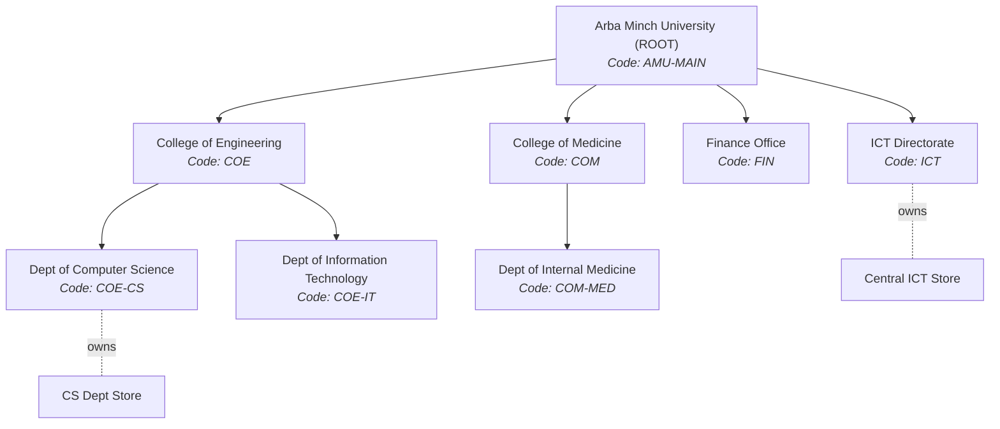
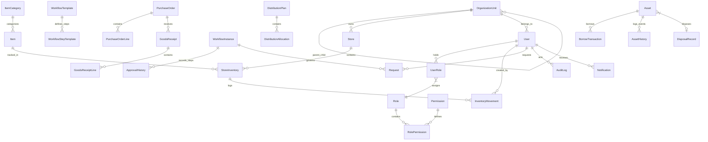
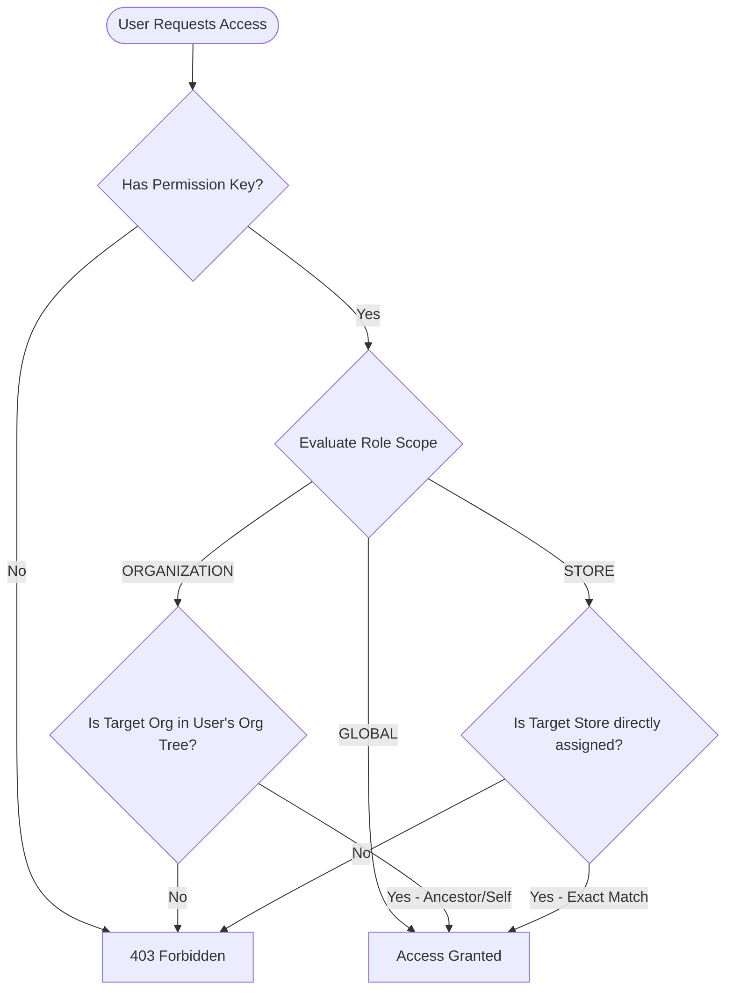
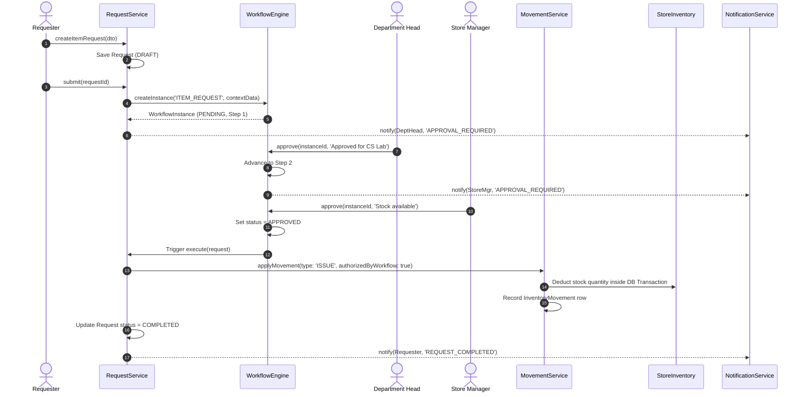
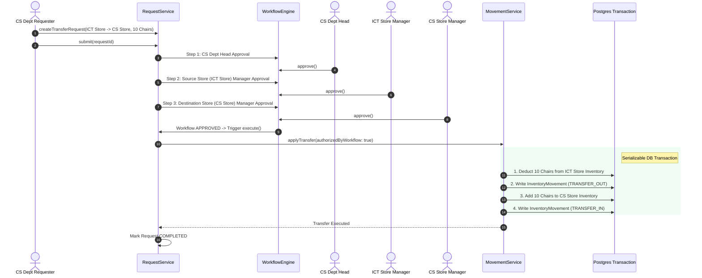

# Arba Minch University (AMU) Resource Management System
## Master Architecture, Design Specifications & Comprehensive Operation Manual

---

## 1. System Overview & Core Purpose

### 1.1 Institutional Context & Problem Statement
Arba Minch University (AMU) is one of Ethiopia's premier higher education institutions, comprising multiple campuses, colleges, faculties, research institutes, central directorates, and administrative units. In such an expansive academic ecosystem, managing equipment, consumable supplies, and high-value fixed assets presents significant operational challenges:

- **Decentralized Operations vs. Central Accountability**: Departments require operational speed to acquire and transfer resources, while university leadership requires absolute auditability and strict fiscal governance.
- **Paper-Based & Fragile Audits**: Legacy physical requisition forms lead to untrackable stock movements, loss of asset custody, phantom inventories, and inability to trace serial numbers.
- **Scope Ambiguity**: Store managers often lack clear boundary controls over which items they can issue, or get deadlocked when attempting inter-departmental transfers.

### 1.2 The AMU Solution
The **AMU Resource Management System** is a unified, web-based Enterprise Resource Planning (ERP) platform designed to manage the entire resource lifecycle:

$$\text{Item Cataloging} \longrightarrow \text{Store Provisioning} \longrightarrow \text{Request Filing} \longrightarrow \text{Multi-Step Approval} \longrightarrow \text{Atomic Execution} \longrightarrow \text{Custody/Asset Tracking} \longrightarrow \text{Disposal/Audit}$$

---

## 2. Inviolable Architectural Principles

The system's integrity relies on **Four Architectural Invariants**:

```
+-----------------------------------------------------------------------------------+
|                            INVIOLABLE PRINCIPLE 1                                 |
|                       Strict Request-Driven Execution                             |
|  No database entity (Stock, Asset, Purchase, Allocation) can be modified directly.|
|  Every physical change MUST originate from a Request governed by a Workflow.       |
+-----------------------------------------------------------------------------------+
                                         │
                                         ▼
+-----------------------------------------------------------------------------------+
|                            INVIOLABLE PRINCIPLE 2                                 |
|                 MovementService Quantity Sequestration                            |
|  StoreInventory.quantity is isolated to MovementService inside DB transactions.   |
|  Direct UPDATE statements outside MovementService are prohibited by policy.       |
+-----------------------------------------------------------------------------------+
                                         │
                                         ▼
+-----------------------------------------------------------------------------------+
|                            INVIOLABLE PRINCIPLE 3                                 |
|                 Two-Part Authorization (Permission + Scope)                       |
|  Holding a Permission (e.g. inventory.issue) is invalid without matching Scope   |
|  (GLOBAL, ORGANIZATION, or STORE) over the target entity.                         |
+-----------------------------------------------------------------------------------+
                                         │
                                         ▼
+-----------------------------------------------------------------------------------+
|                            INVIOLABLE PRINCIPLE 4                                 |
|            Workflow Approval as Higher-Level Authorization                        |
|  Final workflow approval grants system execution authority (authorizedByWorkflow).|
|  Execution is authorized by the completed chain, bypassing actor scope limits.    |
+-----------------------------------------------------------------------------------+
```

---

## 3. Technology Stack & Architectural Rationale

### 3.1 Tech Stack Matrix

```
┌──────────────────────────────────────────────────────────────────────────────────┐
│                                 FRONTEND TIER                                    │
│   React 18  │  Vite  │  TypeScript  │  Tailwind CSS  │  TanStack Query  │ Zustand│
└────────────────────────────────────────┬─────────────────────────────────────────┘
                                         │ RESTful APIs / Bearer JWT
┌────────────────────────────────────────▼─────────────────────────────────────────┐
│                                 BACKEND TIER                                     │
│   NestJS Framework  │  TypeScript  │  Prisma ORM  │  Argon2  │  OpenAPI / Swagger   │
└────────────────────────────────────────┬─────────────────────────────────────────┘
                                         │ PostgreSQL Protocol
┌────────────────────────────────────────▼─────────────────────────────────────────┐
│                                DATABASE & INFRA                                  │
│   PostgreSQL 16  │  Redis (Cache/PubSub ready)  │  Docker Compose  │  Nginx Proxy   │
└──────────────────────────────────────────────────────────────────────────────────┘
```

#### Detailed Justification Table:

| Layer | Component | Selection Rationale & Implementation Details |
|---|---|---|
| **Backend** | **NestJS** | Provides enterprise-grade dependency injection, decoratored route controllers, module boundary isolation, and structured middleware/guard pipelines. |
| **Backend** | **Prisma ORM** | Guarantees compile-time database type safety, serializable transaction isolation, self-referential tree traversal, and clean migration workflows. |
| **Backend** | **PostgreSQL** | Relational ACID engine supporting raw SQL analytics queries, JSONB columns for flexible request details, and serializable transactions. |
| **Backend** | **Argon2id** | State-of-the-art memory-hard password hashing algorithm replacing older bcrypt variants. |
| **Backend** | **Dual JWT Auth** | Emits short-lived access tokens (15m) and long-lived refresh tokens (7d) stored in the database with rotation upon refresh. |
| **Frontend** | **React 18 + Vite** | Provides instantaneous HMR, optimized production bundler, functional components with hooks, and responsive rendering. |
| **Frontend** | **Tailwind CSS** | Utility-first styling framework enabling custom design tokens (primary slate `#0f172a`, accent emerald `#059669`, custom dark surfaces). |
| **Frontend** | **TanStack Query** | Manages asynchronous server state caching, automatic background refetching, mutation side-effects, and unread notification badge polling. |
| **Frontend** | **Zustand** | Lightweight, boilerplate-free state manager for persistent user session tokens (`auth.store.ts`). |
| **Infra** | **Docker Compose** | Standardizes multi-container deployment across backend, frontend, PostgreSQL, Redis, and Nginx. |

---

## 4. System Hierarchy & Data Model Architecture

### 4.1 Organizational Hierarchy Tree
The university structure is represented as a self-referential graph (`OrganizationUnit` with `parentId`).



### 4.2 Database Schema Entity-Relationship Diagram (ERD)



---

## 5. Security & Access Control Mechanics

### 5.1 Three-Tier Role Scoping Engine
Permissions in the AMU system are bound to a specific **Scope Type** (`GLOBAL`, `ORGANIZATION`, `STORE`):



### 5.2 Dynamic Approver Resolution Matrix

| Resolution Strategy | Description | Resolution Algorithm |
|---|---|---|
| `FIXED_ROLE` | Role applies globally across university | Searches `UserRole` where `role.code == roleCode` regardless of scope. |
| `ORG_ROLE_AT_CONTEXT_ORG` | Role at requester's department/college | Searches `UserRole` where `role.code == roleCode` AND (`scopeId == contextData[contextOrgKey]` OR `scopeType == GLOBAL`). |
| `ORG_ROLE_AT_NEXT_LEVEL_UP` | Role at parent organization (e.g. Dean of College) | Resolves `parentOrganizationId` of `contextData[contextOrgKey]` and checks `UserRole` at parent scope. |
| `STORE_ROLE_AT_CONTEXT_STORE` | Store Manager responsible for specific store | Resolves `contextData[contextStoreKey]` and checks `UserRole` at store scope. |

---

## 6. End-to-End Control & Material Flow Sequence Diagrams

### 6.1 Complete Request Lifecycle: Item Issuance



### 6.2 Inter-Store Stock Transfer Execution Flow



---

## 7. Comprehensive Backend & Frontend Module Reference

### 7.1 Backend Modules (`backend/src/modules/`)

```
backend/src/modules/
├── auth/           # Authentication guards, JWT strategy, Argon2 hashing, refresh token rotation
├── users/          # User management CRUD & org associations
├── organization/   # Self-referencing org tree with cycle detection
├── rbac/           # AccessControlService single source of truth for scope checks
├── store/          # Store CRUD & unscoped directory listing
├── item-catalog/   # Item categories & items (CONSUMABLE vs FIXED_ASSET)
├── inventory/      # MovementService sole-writer inventory manager
├── workflow/       # Dynamic workflow engine & approver resolution algorithms
├── request/        # Generic request lifecycle & type-specific execution hooks
├── procurement/    # Supplier directory, purchase orders, & goods receipts
├── distribution/   # Multi-store bulk allocation plans & store confirmations
├── asset/          # Fixed asset registry, borrowing transactions, maintenance, disposals
├── audit/          # Unified multi-source audit timeline service
├── notification/   # In-app notification delivery & unread badges
└── reporting/      # Analytical reports & raw PDF / CSV exporters
```

### 7.2 Frontend Page Hierarchy (`frontend/src/pages/`)

| Route | Component | Description & Key Capabilities |
|---|---|---|
| `/login` | `LoginPage.tsx` | JWT authentication screen with email/password credentials. |
| `/` | `DashboardPage.tsx` | System overview stats, quick links, and pending actions summary. |
| `/organization` | `OrgTreePage.tsx` | Interactive expandable organizational tree with inline unit creation. |
| `/rbac` | `RolesPermissionsPage.tsx` | Role management, permission matrices, and user role assignment. |
| `/stores` | `StoreListPage.tsx` | Scoped store list with manager assignments and store creation. |
| `/stores/:id` | `StoreDetailPage.tsx` | Detailed store view showing manager, org unit, and current inventory. |
| `/items` | `ItemCatalogPage.tsx` | Catalog browser with category filters and consumable/fixed asset tags. |
| `/inventory` | `InventoryDashboardPage.tsx` | Store inventory balances, minimum stock alerts, and movement ledger. |
| `/requests` | `RequestsListPage.tsx` | Filterable list of all submitted requests with status badges. |
| `/requests/new` | `NewRequestPage.tsx` | Form for filing Item, Transfer, Purchase, Borrow, and Disposal requests. |
| `/requests/:id` | `RequestDetailPage.tsx` | Detailed view of a request, its workflow history, and pending step. |
| `/approvals` | `ApprovalsInboxPage.tsx` | Approver inbox showing items waiting for the current user's approval. |
| `/procurement` | `ProcurementPage.tsx` | Suppliers, Purchase Orders, and Goods Receiving interface. |
| `/distribution` | `DistributionPage.tsx` | Distribution plan creation, activation, and store allocation confirmations. |
| `/assets` | `AssetsPage.tsx` | Asset registry, borrowing custody, return inspections, and maintenance. |
| `/notifications` | `NotificationsPage.tsx` | In-app notification inbox with type-specific icons and read toggles. |
| `/reports` | `ReportsPage.tsx` | 8 System reports with data preview tables, CSV export, and PDF download. |
| `/audit` | `AuditLogPage.tsx` | Unified event timeline with filter bar and side-by-side JSON diff viewer. |
| `/users` | `UsersPage.tsx` | User directory table with role listings and user creation form. |

---

## 8. Complete Step-by-Step Verification Manual

Follow this procedure to verify the entire monorepo from scratch.

### Step 1: Environment Provisioning & Database Seed

```bash
# 1. Stop containers and purge existing volumes
docker compose down -v

# 2. Start services in detached mode
docker compose up -d --build

# 3. Generate Prisma client & apply database migrations
docker compose exec backend pnpm prisma:generate
docker compose exec backend pnpm prisma migrate dev --name init_phase8

# 4. Seed the database with organizational data, roles, stores, catalog, & test users
docker compose exec backend pnpm prisma:seed
```

---

### Step 2: Verification Protocol Matrix

```
┌────────────────────────────────────────────────────────────────────────────────┐
│                           SYSTEM VERIFICATION MATRIX                           │
├─────────────────┬───────────────────────────────┬──────────────────────────────┤
│ Test Scenario   │ Primary Action                │ Expected Result              │
├─────────────────┼───────────────────────────────┼──────────────────────────────┤
│ Item Request    │ Request consumable item       │ Stock issued upon final      │
│                 │ (A4 Paper)                    │ store manager approval       │
├─────────────────┼───────────────────────────────┼──────────────────────────────┤
│ Transfer        │ Request stock move between    │ Atomic stock deduction from  │
│ Request         │ ICT Store & CS Store          │ Source & addition to Dest    │
├─────────────────┼───────────────────────────────┼──────────────────────────────┤
│ Borrow Asset    │ Request fixed asset laptop    │ Asset status BORROWED;       │
│                 │ borrowing                     │ return requires inspection   │
├─────────────────┼───────────────────────────────┼──────────────────────────────┤
│ Maintenance     │ Inspect returned asset as     │ Asset status MAINTENANCE;    │
│ Lifecycle       │ DAMAGED                       │ Complete Maint returns status│
├─────────────────┼───────────────────────────────┼──────────────────────────────┤
│ Notifications   │ Perform any workflow action   │ Bell badge increments;       │
│                 │                               │ inbox logs notification      │
├─────────────────┼───────────────────────────────┼──────────────────────────────┤
│ Audit Trail     │ Perform administrative update │ Event logged in AuditLog with│
│                 │ or movement                   │ before/after diff payload    │
├─────────────────┼───────────────────────────────┼──────────────────────────────┤
│ Reports         │ Export Inventory/Movement     │ Instant CSV download and     │
│                 │ reports                       │ zero-dependency PDF rendering│
└─────────────────┴───────────────────────────────┴──────────────────────────────┘
```

#### Detailed Test Commands & UI Instructions:

1. **Item Request Flow**:
   - Log in as `wftest.requester@amu.edu.et` (`ChangeMe123!`).
   - Create Item Request for **A4 Paper** (Qty: 5) from **Workflow Test Source Store**.
   - Log in as `wftest.depthead@amu.edu.et` → Navigate to `/approvals` → Click **Approve**.
   - Log in as `wftest.sourcemanager@amu.edu.et` → Navigate to `/approvals` → Click **Approve**.
   - Verify Request status becomes `COMPLETED` and stock is deducted in `/inventory`.

2. **Transfer Request Flow**:
   - Log in as `wftest.requester@amu.edu.et` → Submit Transfer Request for **Office Chair** (Qty: 2) from **Workflow Test Source Store** to **Workflow Test Destination Store**.
   - Approve sequentially as `wftest.depthead`, `wftest.sourcemanager`, and `wftest.destmanager`.
   - Verify paired `TRANSFER_OUT` and `TRANSFER_IN` rows exist in `/inventory` movement ledger.

3. **Asset Custody & Maintenance Flow**:
   - Log in as `admin@amu.edu.et` → Register fixed asset tag `AMU-LAP-2026-999` (**Dell Laptop**) under **ICT Store**.
   - Submit Borrow Request as `wftest.requester@amu.edu.et`. Approve step by step.
   - Click **Issue Asset** in `/assets` → Asset status changes to `BORROWED`.
   - Click **Return Asset** → Asset status changes to `RETURNED_PENDING_INSPECTION`.
   - Click **Inspect** → Select `DAMAGED` → Asset status changes to `UNDER_MAINTENANCE`.
   - In Asset Registry, click **Complete Maint.** → Asset status changes back to `AVAILABLE`.

4. **Notifications, Audit Logs & Reporting**:
   - View top bar notification bell badge → Click bell to open `/notifications`.
   - Open `/audit` as Admin → Filter by entity type `Asset` → Click **View diff** to inspect event snapshots.
   - Open `/reports` → Click **Preview** on *Low Stock Report* → Click **Export PDF** to test PDF engine.

---

## 9. Conclusion & Production Readiness

The **AMU Resource Management System** codebase is architecturally complete across all core functional requirements (Phases 0–8). All system components adhere strictly to the core business principles, ensuring type safety, atomic financial and inventory auditability, and role-scoped authority.
